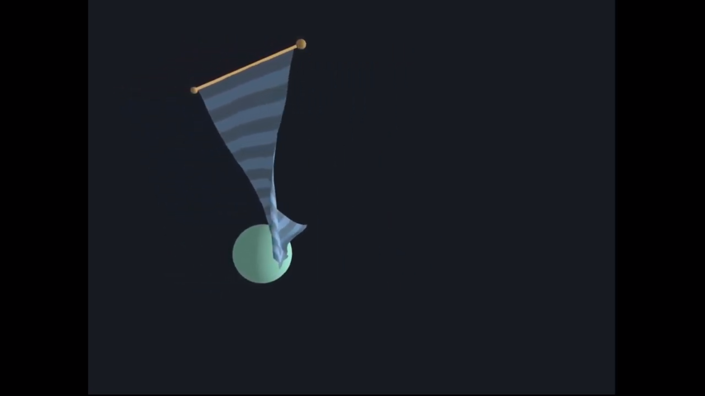

# CSCI 5611: Project 2 -- Physically-Based Animation with PDEs

## Group

* Alexandra Hanson (hans7203)

## Attempted features

I have completed the following features:

* Multiple Ropes (at least 2D)*
* Cloth Simulation
* 3D Simulation & Rendering
* User Interaction
* SPH Fluid Simulation

## About (& some reflection) -- TO DO

This is a project for CSCI 5611: Animation and Planning in Games that .

## Code

I have a private repository that contains my work for the course. It should be shared with Prof. Guy and Dan. The cloth simulation should be linked at [csci-5611-animation-and-planning-in-games/assignments/project2/cloth/](https://github.com/alexandra-hanson/csci-5611-animation-and-planning-in-games/tree/main/assignments/project2/cloth) and the sph fluid simulation should be linked at [csci-5611-animation-and-planning-in-games/assignments/project2/water/](https://github.com/alexandra-hanson/csci-5611-animation-and-planning-in-games/tree/main/assignments/project2/water).

## Media

I implemented the following features, which you can see in the two videos below.

### Cloth Simulation

<iframe width="560" height="315" src="https://www.youtube.com/embed/dMBGsU7PwBU" title="YouTube video player" frameborder="0" allow="accelerometer; autoplay; clipboard-write; encrypted-media; gyroscope; picture-in-picture" allowfullscreen></iframe>

| **Component**      | **Timestamps** |
| ----------- | ----------- |
| Multiple Ropes (at least 2D)* & Cloth Simulation | 0:03, (and whole video) |
| User Interaction | 0:33, user controls mint sphere by keys `o`, `k`, `l`, and `;` |
| 3D Rendering | 1:01, change in camera angle and position |
| 3D Simulation | whole video |

### SPH Fluid Simulation

<iframe width="560" height="315" src="https://www.youtube.com/embed/VpA5LzJUj38" title="YouTube video player" frameborder="0" allow="accelerometer; autoplay; clipboard-write; encrypted-media; gyroscope; picture-in-picture" allowfullscreen></iframe>

## Art Contest Submission -- TO DO

My animations are simple but I still want to submit for the art contest.

## Credit -- TO DO

As you can tell from the video and project repository, my project was pretty simple and I didn't use any libraries.