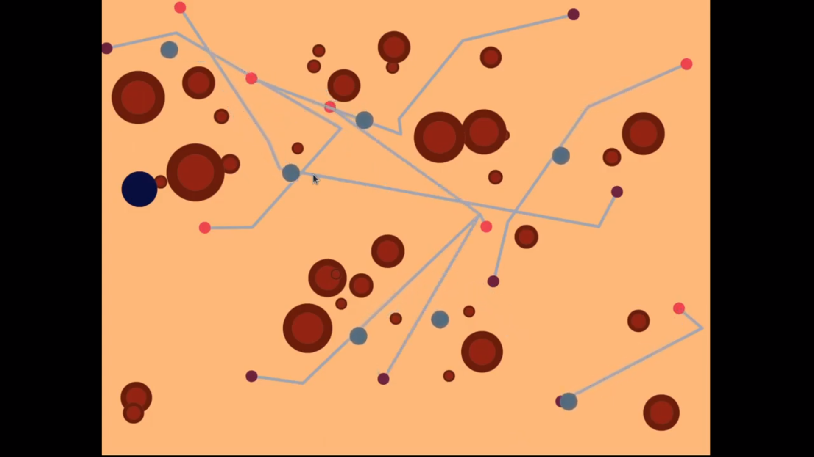

# CSCI 5611: Project 1 -- Geometry & Planning

## Group

* Alexandra Hanson (hans7203)

## About

## Code

I have a private repository that contains my work for the course. It should be shared with Prof. Guy and Dan. The simulation project should be linked at [csci-5611-animation-and-planning-in-games/assignments/project1/simulation/](https://github.com/alexandra-hanson/csci-5611-animation-and-planning-in-games/tree/main/assignments/project1/simulation).

## Media

I implemented the following features, which you can see in the video below.

<iframe width="560" height="315" src="https://www.youtube.com/embed/wYgd9Fd5ZJM" title="YouTube video player" frameborder="0" allow="accelerometer; autoplay; clipboard-write; encrypted-media; gyroscope; picture-in-picture" allowfullscreen></iframe>

| **Component**      | **Timestamps** |
| ----------- | ----------- |
| Single agent navigation   | 0:16 |
| User Scenario Editing     | 0:07, user adds obstacles by pressing "o"   2:12, user removes obstacles by pressing "p"   0:44, user adds agents by left-clicking   1:34, user removes agents by right-clicking |
| Realtime User Interaction | 1:08, user controls purple obstacle by arrow keys |
| Multiple Agents Planning | 0:50, (also most of the video) |
| Crowd Simulation | 0:34, agents avoid a head-on collision near screen center   0:50, agents avoid angled collision |

## Art Contest Submission

My animation is simple but I still like the way it looks. It kind of reminds me of cells or something.

## Credit

As you can tell from the video and project repository, my project was pretty simple and I didn't use any libraries. I used the Proj1_Test.pde file provided with the original download from canvas as a jumping off point for constructing the project, and took inspiration from our in-class activities for how to go about coding the desired behavior.

I used [Dijkstra's algorithm](https://en.wikipedia.org/wiki/Dijkstra%27s_algorithm) for the uniform cost search in the path planning library PRM.pde.

I think that is all. It is not very fancy.